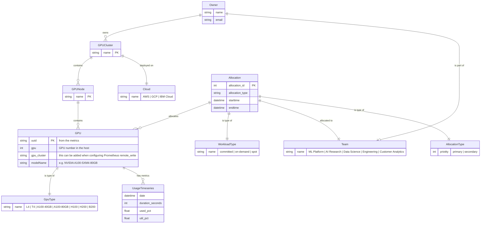

# Data analysis

This table gives an Entity Relationship diagram of the concepts discussed in the requirements document and how
they relate to the dashboard prototype.

## DCGM metrics

A certain amount of data is knowable from a cluster that has been opted in to this monitoring system.
Presuming that DCGM metrics are retrieved from multiple clusters (and tagged with the name of that cluster)
the GPU information should appear in to the `GPU` table in the diagram below.

### DCGM_FI_DEV_GPU_UTIL

Ths metric can tell us a lot about the GPU it came from:

```
DCGM_FI_DEV_GPU_UTIL {DCGM_FI_DRIVER_VERSION="590.44.01",Hostname="worker-gpu2",UUID="GPU-5d11648b-7cc4-2e4c-0de3-bd02f3d6a2c5",container="nvidia-dcgm-exporter",device="nvidia4",endpoint="gpu-metrics",exported_container="main",exported_namespace="kserve-lab",exported_pod="qwen3-next-80b-kserve-f7bdf9b9b-7ngnd",gpu="4",gpu_cluster="ai_catalyst",instance="10.128.126.60:9400",job="nvidia-dcgm-exporter",modelName="NVIDIA A100-SXM4-80GB",namespace="gpu-operator",pci_bus_id="00000000:0C:05.0",pod="nvidia-dcgm-exporter-kmtlw",prometheus="monitoring/prometheus-stack-kube-prom-prometheus",prometheus_replica="prometheus-prometheus-stack-kube-prom-prometheus-0",service="nvidia-dcgm-exporter"}
```

Here we can figure out the
* cluster name
* the node name
* the number of the GPU within the node
* the model of GPU
* the name & namespace of the pod *using* the GPU

There is also a timestamp and a utilization % associated with this.

## Other information

While metrics information can be gathered automatically once a cluster is "connected", it cannot tell us who the
teams are and who owns or is allocated to what.

This must be stored in its own data store, entered through some kind of a form or an automated process and correlated with the metrics data.

## Entity Relationship Diagram

The diagram shows the major data classes and how they relate to each other.

`UsageTimeseries` entity class is expected to reside in a time series database.

All other entities are expected to be in the data store.

A front end tool e.g. Grafana or a custom dashboard should be able to retrieve from both.

